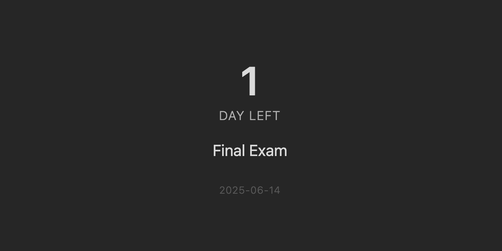
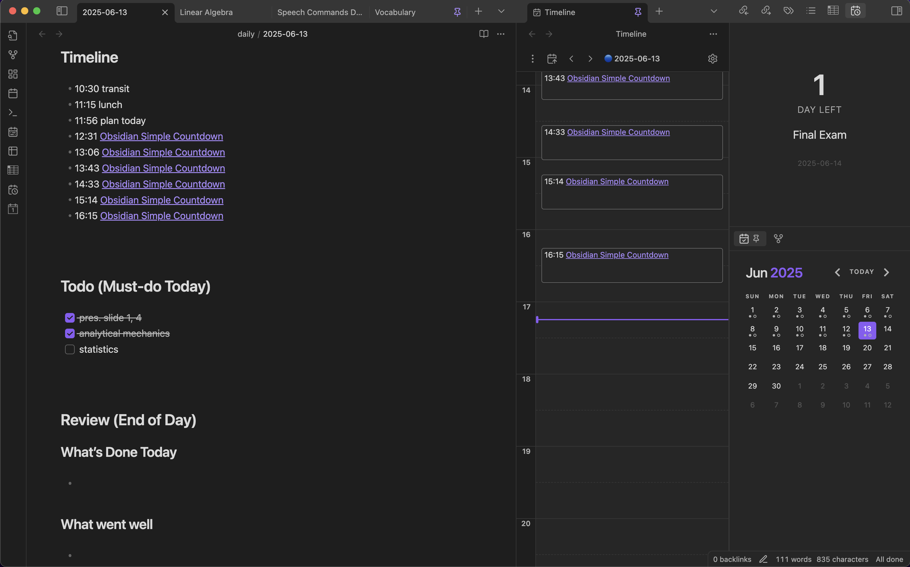

# Simple Countdown



A clean, minimalist countdown plugin for Obsidian that displays days remaining
until your important events.

## Features

- **Simple Setup**: Just enter an event name and target date
- **Smart Display**: Shows "Today" on event day, with automatic singular/plural
  handling
- **Clean Design**: Professional typography with subtle date footer
- **Real-time Updates**: Automatically refreshes every minute
- **Sidebar Integration**: Opens in the right sidebar with a ribbon icon

## Usage



1. Click the calendar icon in the ribbon to open the countdown view
2. Go to Settings → Simple Countdown to configure:
   - **Event Name**: The name of your event
   - **Target Date**: Date in YYYY-MM-DD format (e.g., 2025-12-31)

The countdown will display:

- Number of days remaining (or "Today" on event day)
- Status label ("days left", "day left", "days ago", etc.)
- Your event name
- Target date (hidden on event day for a cleaner look)

## Examples

**Future Event:**

```text
    15
DAYS LEFT
 Macworld
2007-01-09
```

**Event Day:**

```text
  Today

 Macworld
```

**Past Event:**

```text
    3
 DAYS AGO
 Macworld
2007-01-09
```

## Installation

### From Obsidian Community Plugins

1. Open Settings → Community plugins
2. Browse for "Simple Countdown"
3. Install and enable

### Manual Installation

1. Download the plugin code
2. Place the entire folder in `{VaultFolder}/.obsidian/plugins/`
3. Reload Obsidian and enable the plugin

## Support

If you encounter any issues or have suggestions, please
[create an issue](https://github.com/smz-exe/obsidian-simple-countdown/issues)
on GitHub.
